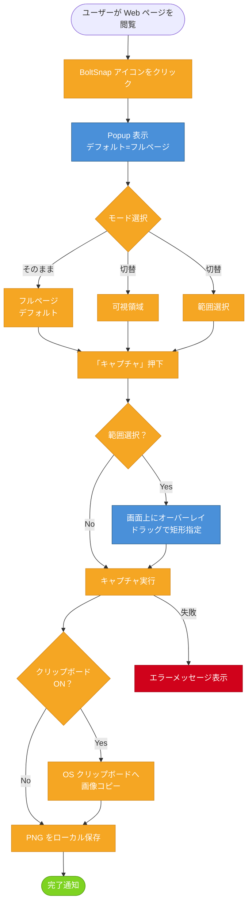

# 01. ユーザーフロー v1

BoltSnap の典型操作フロー。

## 凡例

| 色 | 用途 |
|----|------|
| 青 | 画面（Popup / オーバーレイ） |
| オレンジ | 操作・分岐 |
| 緑 | 完了状態 |
| 赤 | 警告・エラー |

## 対応 BDD シナリオ

| フロー | シナリオ |
|--------|----------|
| デフォルト → キャプチャ | デフォルトはフルページキャプチャ |
| フルページ → 保存 | フルページキャプチャで PNG がローカル保存される |
| 可視領域 → 保存 | 可視領域キャプチャ |
| 範囲選択 → オーバーレイ → 保存 | 範囲選択キャプチャ |
| クリップボード ON → コピー＋保存 | クリップボードへ同時コピー |
| 制限付きページ → 失敗 | キャプチャ失敗時にユーザーへ通知する |
