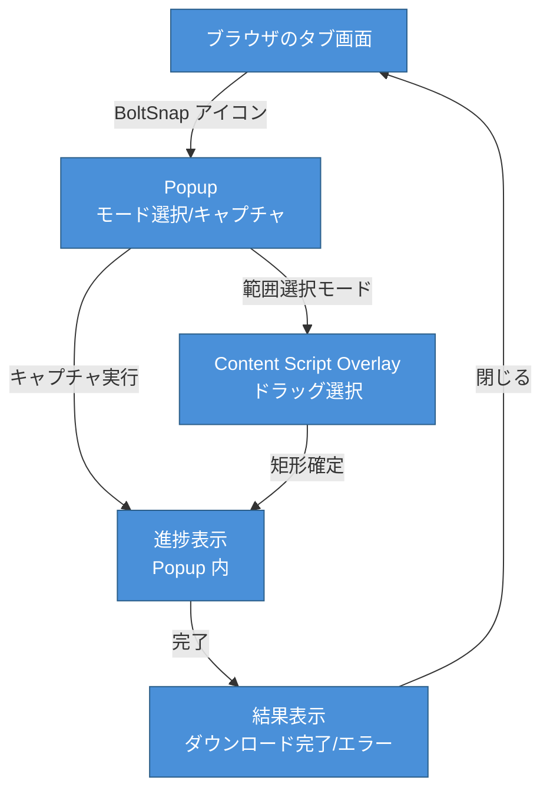

# 02. 画面遷移図 v1

BoltSnap 拡張機能における画面単位の遷移を表す。

```mermaid
flowchart TD
    Browser[ブラウザのタブ画面] -->|BoltSnap アイコン| Popup[Popup<br/>モード選択/キャプチャ]
    Popup -->|範囲選択モード| Overlay[Content Script Overlay<br/>ドラッグ選択]
    Popup -->|キャプチャ実行| Progress[進捗表示<br/>Popup 内]
    Overlay -->|矩形確定| Progress
    Progress -->|完了| Result[結果表示<br/>ダウンロード完了/エラー]
    Result -->|閉じる| Browser

    classDef screen fill:#4A90D9,stroke:#2C5F8A,color:#fff
    classDef action fill:#F5A623,stroke:#D4891A,color:#fff

    class Browser,Popup,Overlay,Progress,Result screen
```

## 凡例

| 色 | 用途 |
|----|------|
| 青 | 画面 |

## 対応 BDD シナリオ

`docs/features/01-screenshot-capture.feature` 全シナリオ
